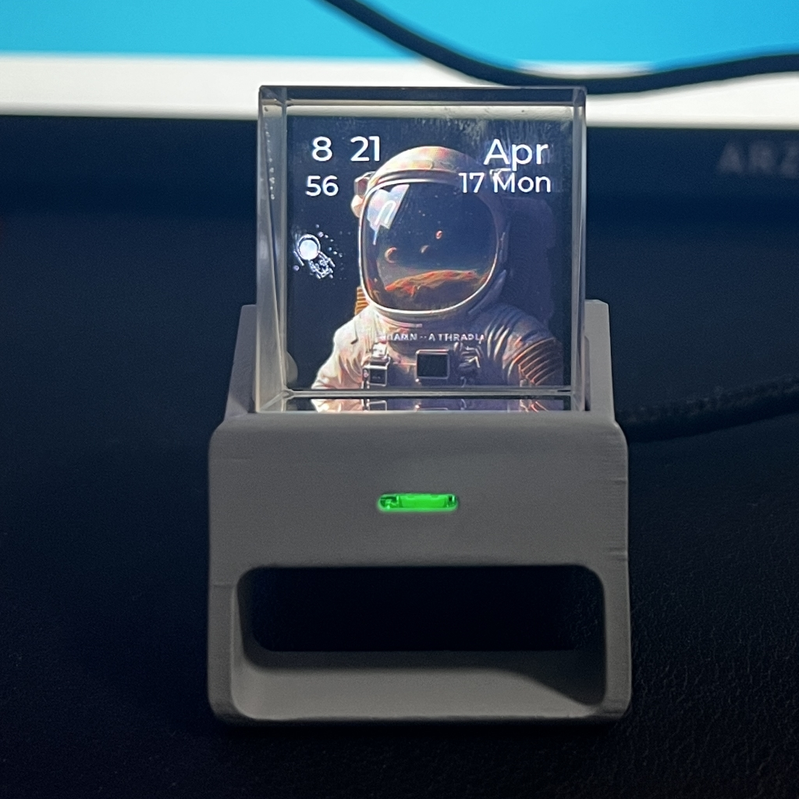
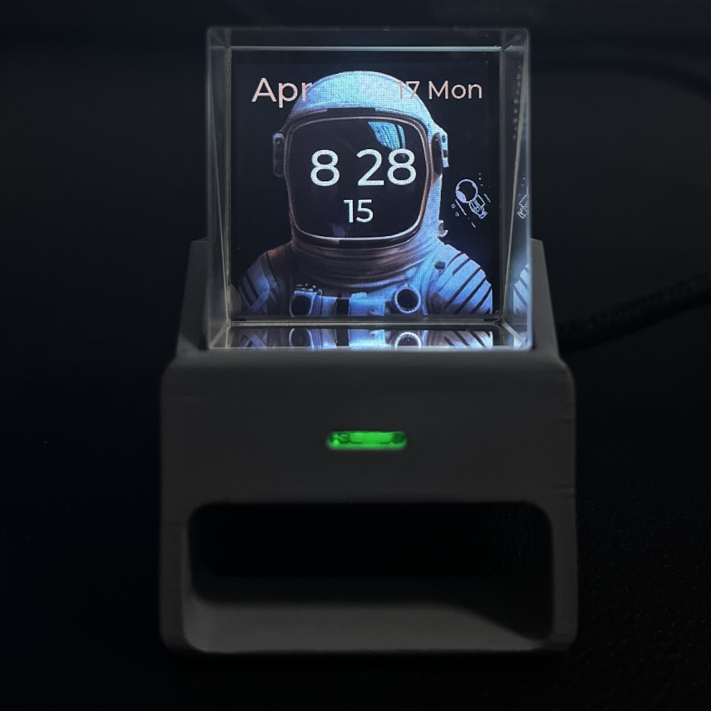
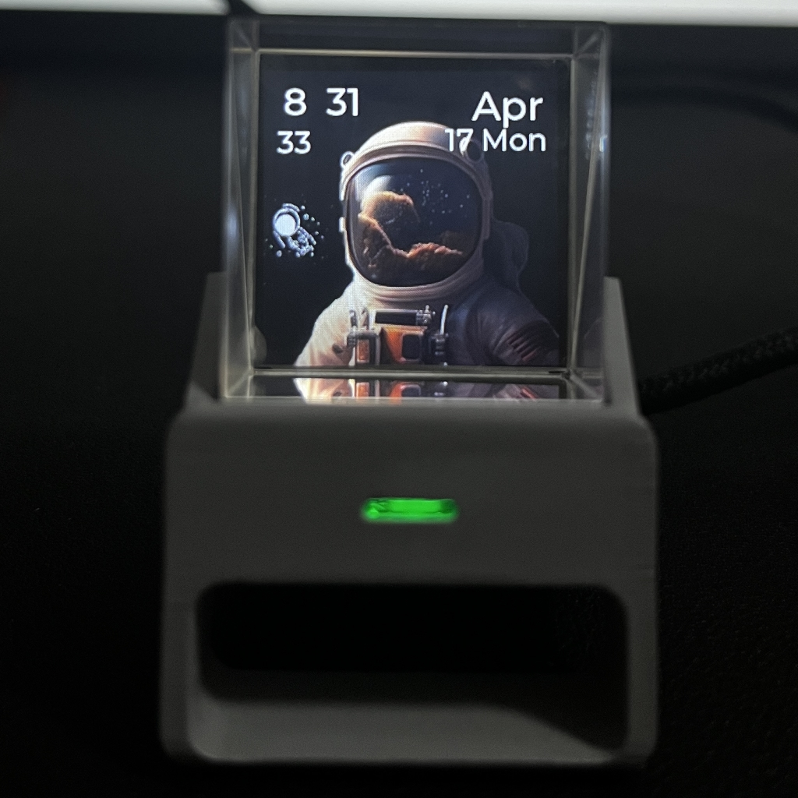
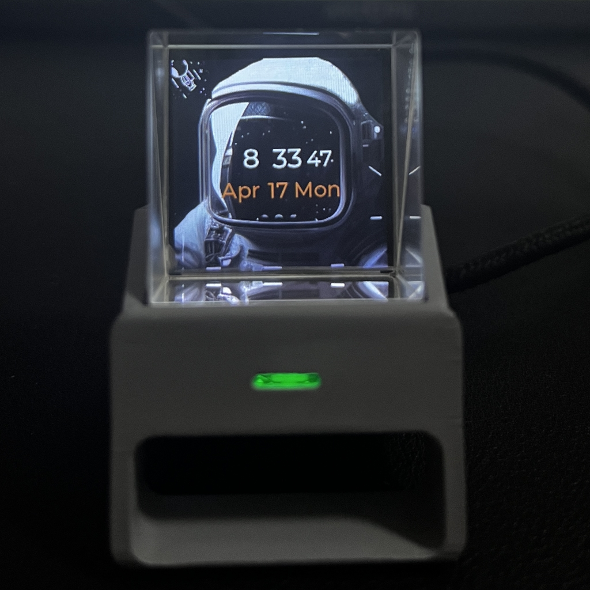
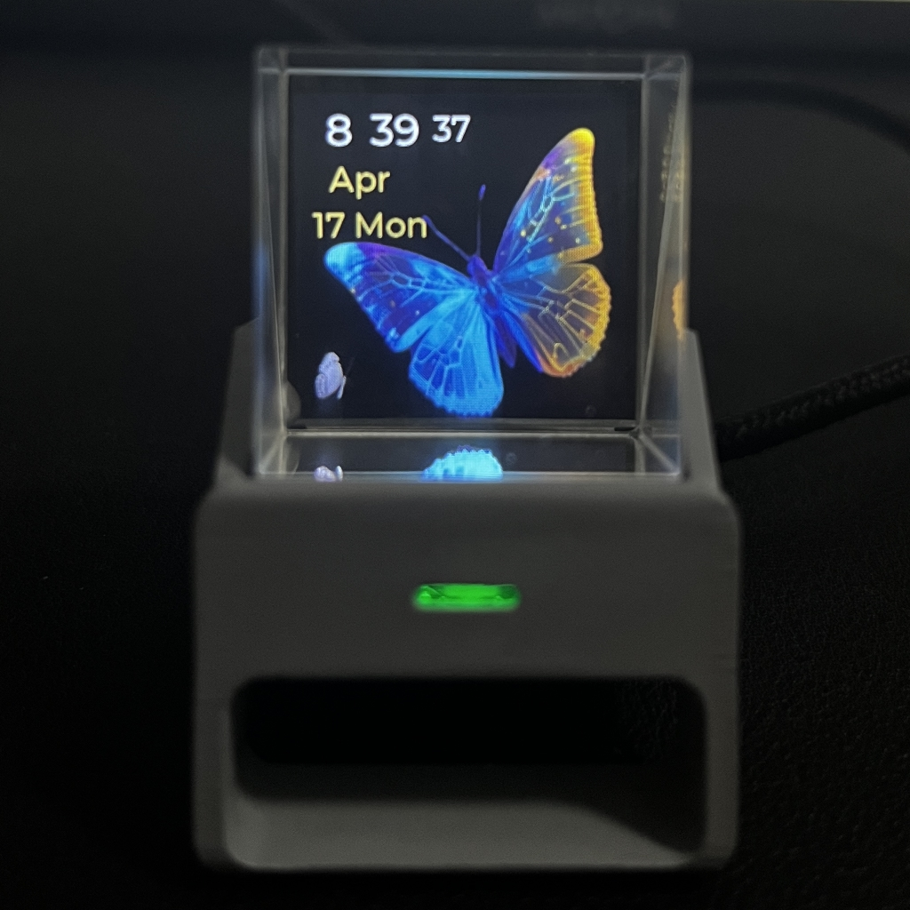
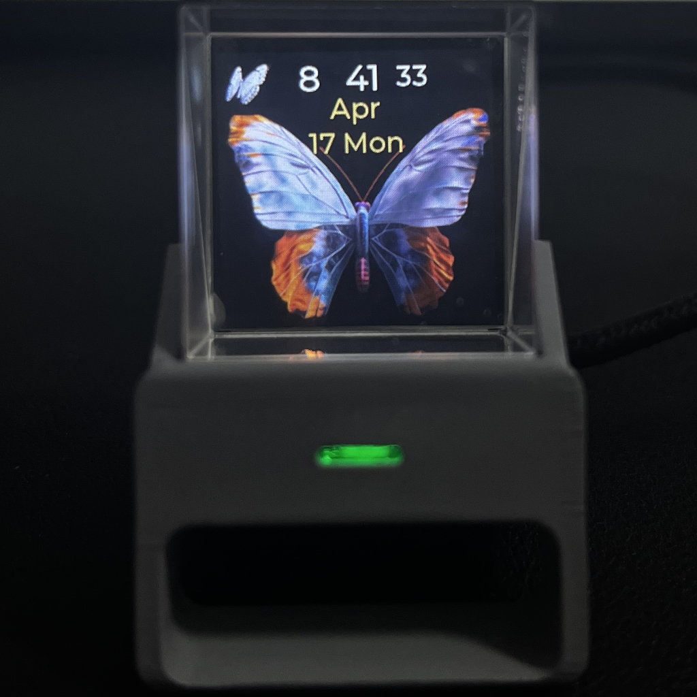
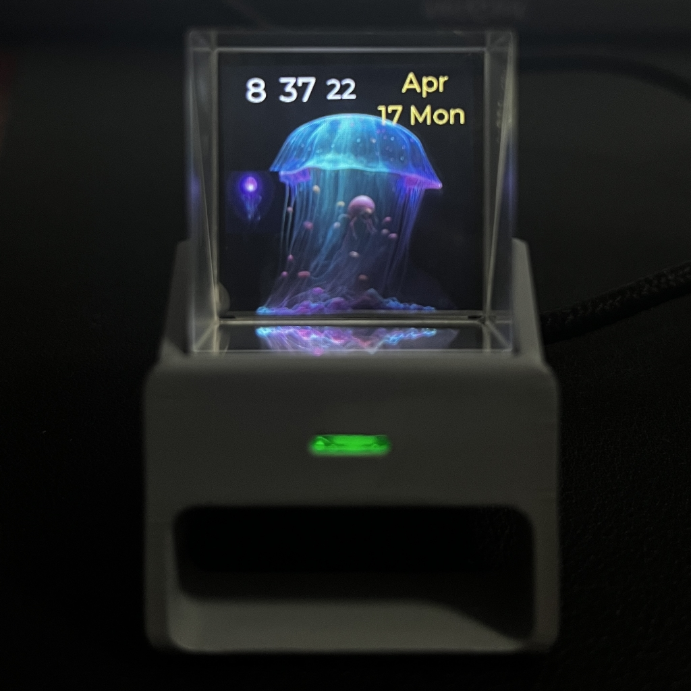
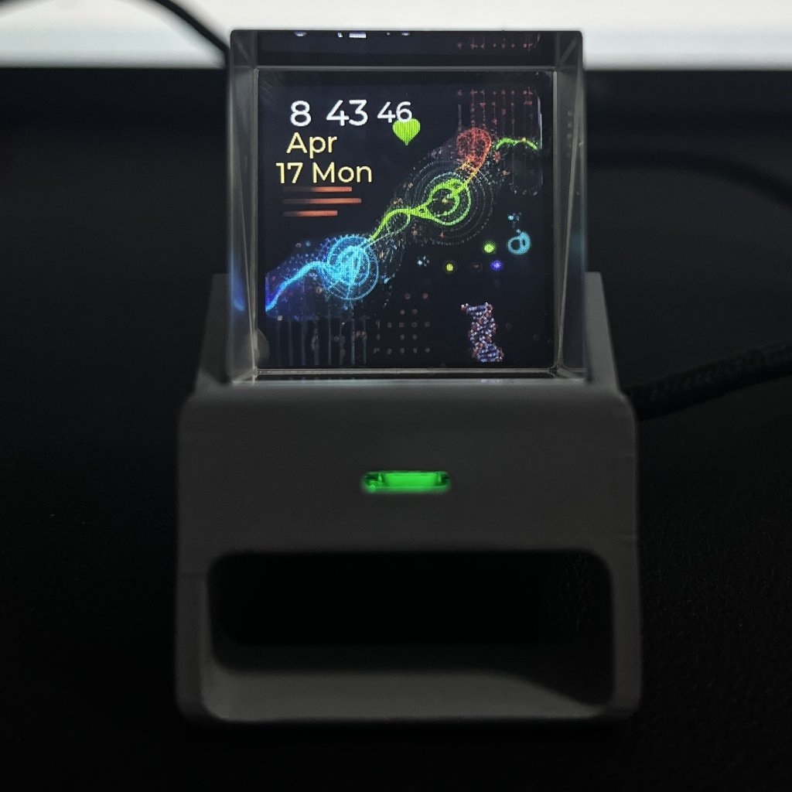

# HoloClock
All about holo clock

## 1.Different theme style firmware

|Theme Name|Basic Description|Picture|
|:--:|:--:|:--:|
| space man 1 |Basic models||
| space man 2 |Basic models||
| space man 3 |Basic models||
| space man 4 |Basic models||
| space man 5 |Basic models||
| butterfly 1 | butterfly gif||
| butterfly 2 | butterfly gif||
| jellyfish 1 | jellyfish gif||
| biology dna | dna gif ||

## 2.How to update firmware

## 3.Change the mp4 content of the holoclock