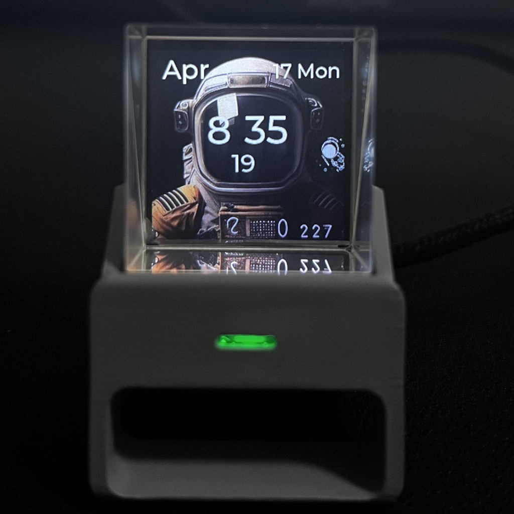

# HoloClock
All about holo clock

## 1.Different theme style firmware

|Theme Name|Basic Description|Picture|
|:--:|:--:|:--:|
| [space man 1](https://github.com/fiberpunk1/HoloClock/releases/download/v0.2/HoloClock-t5-en-v0.2-theme-1.bin) |Basic models||
| [space man 2](https://github.com/fiberpunk1/HoloClock/releases/download/v0.2/HoloClock-t5-en-v0.2-theme-2.bin) |Basic models||
| [space man 3](https://github.com/fiberpunk1/HoloClock/releases/download/v0.2/HoloClock-t5-en-v0.2-theme-3.bin) |Basic models||
| [space man 4](https://github.com/fiberpunk1/HoloClock/releases/download/v0.2/HoloClock-t5-en-v0.2-theme-4.bin) |Basic models||
| [space man 5](https://github.com/fiberpunk1/HoloClock/releases/download/v0.2/HoloClock-t5-en-v0.2-theme-5.bin) |Basic models||
| [butterfly 1](https://github.com/fiberpunk1/HoloClock/releases/download/v0.2/HoloClock-t5-en-v0.2-theme-b1.bin) | butterfly gif||
| [butterfly 2](https://github.com/fiberpunk1/HoloClock/releases/download/v0.2/HoloClock-t5-en-v0.2-theme-b2.bin) | butterfly gif||
| [jellyfish 1](https://github.com/fiberpunk1/HoloClock/releases/download/v0.2/HoloClock-t5-en-v0.2-theme-jellyfish.bin) | jellyfish gif||
| [biology dna](https://github.com/fiberpunk1/HoloClock/releases/download/v0.2/HoloClock-t5-en-v0.2-theme-dna.bin) | dna gif ||

## 2.How to update firmware

[HoloClock update firmware](https://docs.google.com/presentation/d/1tGSQJ-QNTF4O9Le1p9SCZYB10ZSOF2crVGB-SorwDfQ/edit?usp=share_link)

## 3.Change the mp4 content of the holoclock

[Change mp4 content of holoclock](https://docs.google.com/presentation/d/1y3IwDwjFQHf_qk9g2-_6abs2Ndtn1MmuqI5m8sPeSbs/edit?usp=share_link)